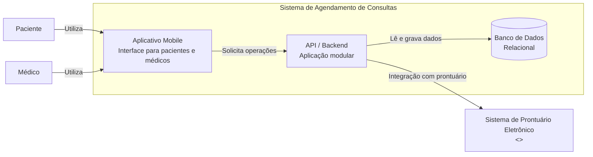
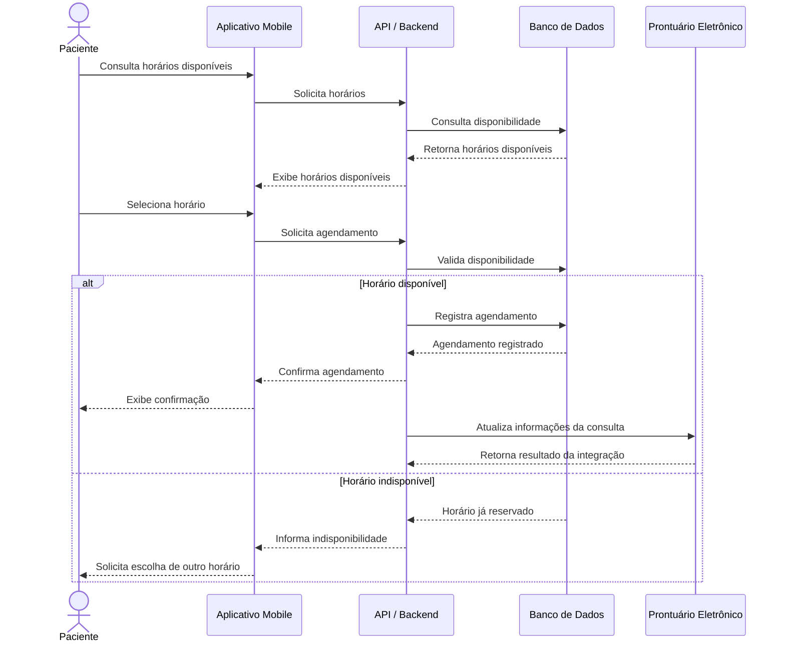

# Documentação Arquitetural — Aplicativo de Agendamento de Consultas

## 1. Sobre o projeto

Este repositório apresenta uma pequena fase de *discovery* arquitetural de um aplicativo móvel para agendamento de consultas médicas, utilizando **GenAI** e a abordagem **diagrams as code**.

O cenário é acadêmico e foi reaproveitado de uma atividade anterior da disciplina. Como o contexto original possui informações limitadas, foram identificadas lacunas e adotadas algumas hipóteses para permitir a elaboração dos diagramas. Essas hipóteses são explicitadas para não serem confundidas com requisitos reais do sistema.

## 2. Meus inputs e definição do escopo

O contexto inicial fornecido para a GenAI foi baseado no projeto anterior, que descrevia um aplicativo móvel com:

* cadastro de usuários;
* gerenciamento de agenda médica;
* agendamento de consultas;
* notificações;
* integração com um sistema externo de prontuário eletrônico.

Durante o *discovery*, o escopo foi reduzido para a **jornada de agendamento de uma consulta**, envolvendo consulta de horários disponíveis, seleção e confirmação do agendamento e posterior integração com o prontuário.

Para simplificar a atividade, foram adotadas as seguintes decisões:

* pacientes e médicos utilizam o mesmo aplicativo móvel;
* o backend é uma aplicação modular exposta por uma API única;
* existe um único banco de dados relacional;
* notificações são tratadas como responsabilidade do backend, sem especificar um provedor;
* o prontuário eletrônico é externo ao sistema;
* a integração com o prontuário é encapsulada pelo backend.

Essas decisões foram tomadas especificamente para o exercício e não representam requisitos confirmados do sistema original.

## 3. Nível e limites da arquitetura

O diagrama estrutural utiliza uma visão inspirada no **C4 no nível de Containers**. O objetivo é mostrar os principais blocos do sistema e suas dependências, sem detalhar classes, componentes, endpoints ou tecnologias.

O diagrama comportamental representa a jornada crítica de **agendamento de uma consulta** por meio de um diagrama de sequência.

O limite principal do sistema inclui o aplicativo móvel, o backend e o banco de dados. O sistema de prontuário eletrônico fica fora desse limite e é tratado como uma integração externa.

O backend concentra as responsabilidades de agenda, agendamento, persistência e notificações. A separação dessas responsabilidades é conceitual e não implica a adoção de microsserviços.

## 4. Diagrama estrutural

A visão estrutural representa os principais containers e suas dependências.



O código do diagrama está disponível em [`diagrams/container.md`](diagrams/container.md).

## 5. Diagrama comportamental

A jornada escolhida como fluxo crítico é o **agendamento de uma consulta**.



O código do diagrama está disponível em [`diagrams/sequence.md`](diagrams/sequence.md).

## 6. Restrições adotadas

Os diagramas foram elaborados considerando as seguintes restrições:

* manter o diagrama estrutural no nível de Containers;
* não representar classes, componentes, endpoints ou tabelas;
* utilizar uma API única como ponto de entrada do aplicativo;
* não assumir arquitetura de microsserviços sem evidências;
* manter o prontuário eletrônico fora do limite do sistema;
* encapsular a integração com o prontuário no backend;
* não assumir tecnologias ou protocolos não fornecidos;
* mostrar somente dependências relevantes ao escopo;
* manter hipóteses e lacunas explícitas.

## 7. Decisões e ajustes sobre a saída da GenAI

A GenAI foi utilizada para produzir uma proposta inicial de representação arquitetural. A saída foi revisada antes de ser incorporada ao repositório.

### API única

Foi mantida uma API única em vez de dividir o backend em múltiplos serviços. A escolha reduz a complexidade e evita assumir microsserviços sem evidências no contexto.

### Backend modular

As responsabilidades de agenda, agendamento, persistência e notificações foram mantidas dentro de um backend único. A modularidade é conceitual e não representa necessariamente serviços independentes.

### Banco de dados único

Foi adotado um único banco de dados relacional. A tecnologia não foi especificada porque não fazia parte dos inputs disponíveis.

### Prontuário como sistema externo

A integração com o prontuário foi representada como externa ao sistema. O acesso foi concentrado no backend para evitar que o aplicativo ou outras responsabilidades dependam diretamente de detalhes do sistema externo.

### Notificações

Não foi incluído um provedor específico de notificações. Embora o sistema original mencione notificações, o contexto não informa qual tecnologia ou serviço seria utilizado.

### Ordem do agendamento e integração

Foi adotada a hipótese de que o agendamento é registrado e confirmado antes da atualização do prontuário. Essa decisão evita tornar o sistema externo um pré-requisito para a confirmação da operação principal.

### Cenário de horário indisponível

Foi acrescentado ao diagrama de sequência um caminho alternativo para o caso de o horário selecionado já ter sido reservado. Essa situação decorre da regra assumida de que um horário não pode ser reservado simultaneamente por dois pacientes.

## 8. O que a GenAI inferiu corretamente

A GenAI conseguiu inferir adequadamente:

* a necessidade de um aplicativo como interface dos usuários;
* a existência de um backend para intermediar as operações;
* a necessidade de persistência;
* a existência de uma integração externa com o prontuário;
* a necessidade de separar a integração externa das demais responsabilidades;
* o agendamento como uma jornada crítica adequada para o diagrama comportamental.

A IA também ajudou a identificar decisões que não estavam presentes no contexto original.

## 9. O que permaneceu como lacuna

Mesmo após a elaboração dos diagramas, permanecem indefinidos:

* tecnologias do aplicativo, backend e banco;
* autenticação e autorização;
* modelo detalhado de dados;
* contrato e protocolo da integração com o prontuário;
* dados enviados e recebidos nessa integração;
* mecanismo efetivo de notificações;
* comportamento diante da indisponibilidade do prontuário;
* regras detalhadas de disponibilidade e cancelamento;
* requisitos de segurança e privacidade;
* requisitos de desempenho e disponibilidade;
* infraestrutura e estratégia de implantação.

Esses pontos não foram preenchidos artificialmente, pois representam decisões que deveriam ser definidas antes de uma implementação real.

## 10. O que seria necessário para um agente implementar o sistema sem inventar decisões?

Para que esta documentação pudesse servir como contexto suficiente para um agente de desenvolvimento, seria necessário complementá-la principalmente com:

* requisitos funcionais detalhados;
* regras completas de negócio;
* modelo de dados;
* contratos das APIs;
* contrato da integração com o prontuário;
* mecanismos de autenticação e autorização;
* estratégia de notificações;
* requisitos de segurança, desempenho e disponibilidade;
* tratamento de erros e falhas;
* decisões tecnológicas;
* infraestrutura e estratégia de implantação;
* critérios de aceitação e testes.

A principal lacuna não é apenas a ausência de mais diagramas, mas a ausência de decisões e regras que determinem **como o sistema deve se comportar**.

## 11. Conclusão

A utilização de GenAI acelerou a identificação de lacunas e a elaboração dos diagramas, mas a saída do modelo não foi tratada como uma definição automática da arquitetura.

A revisão humana foi necessária para controlar o escopo, eliminar complexidade não justificada e distinguir fatos fornecidos de hipóteses adotadas.

O resultado mostra que diagramas em código podem funcionar como documentação versionável e revisável, mas seu valor como contexto para agentes depende da existência de informações suficientemente precisas sobre responsabilidades, integrações, regras e decisões arquiteturais.

## 12. Artefatos do repositório

```text
agendamento-consultas-diagrams/
├── README.md
├── discovery.md
└── diagrams/
    ├── container.md
    └── sequence.md
```

O arquivo `discovery.md` registra os prompts utilizados e o processo de interação com a GenAI. Os arquivos na pasta `diagrams/` contêm os códigos Mermaid dos diagramas finais.
