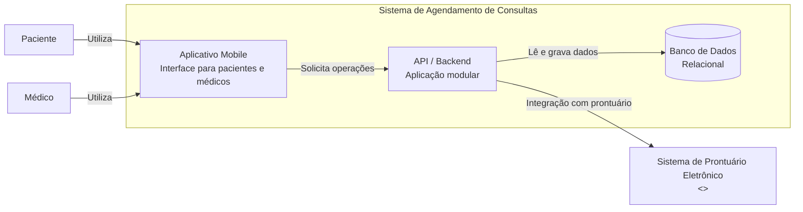
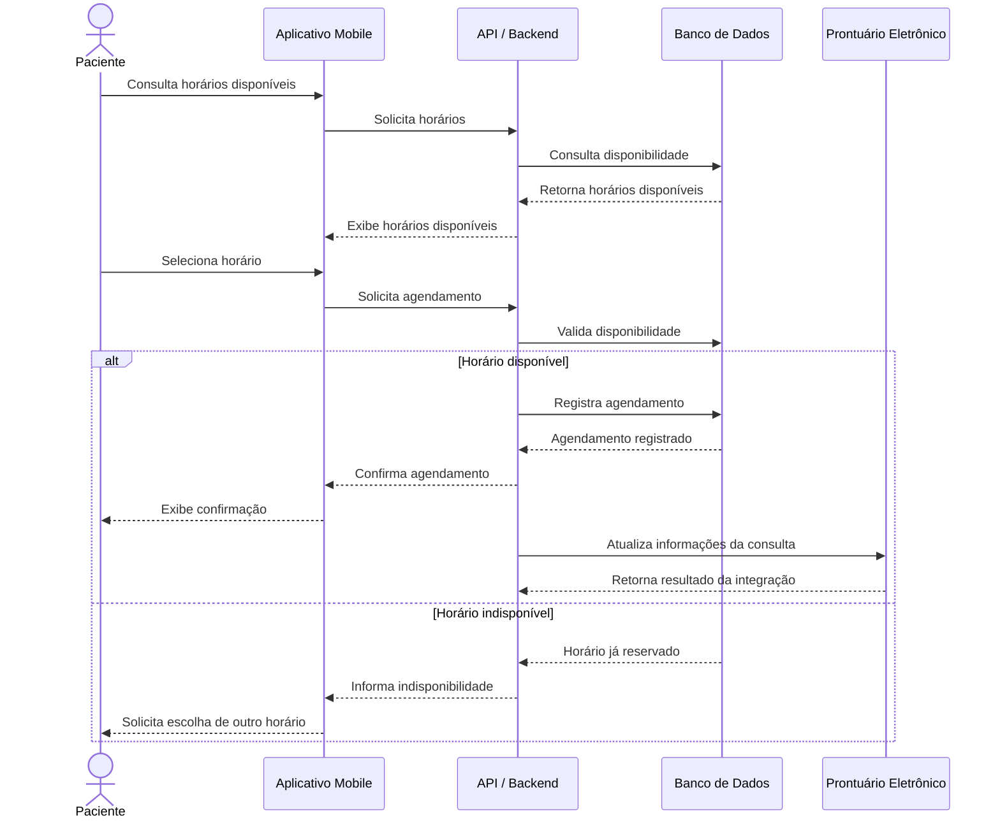

# Documentação Arquitetural — Aplicativo de Agendamento de Consultas

## 1. Visão geral

Este repositório documenta uma pequena fase de *discovery* arquitetural de um aplicativo móvel para agendamento de consultas médicas. O trabalho utiliza a abordagem **diagrams as code**, mantendo os diagramas em Mermaid para que possam ser versionados, revisados e reproduzidos junto à documentação.

O sistema é um cenário acadêmico, utilizado anteriormente em outra atividade da disciplina. Para esta etapa, o escopo foi reduzido à jornada de agendamento de uma consulta.

## 2. Escopo

O recorte contempla:

* consulta de horários disponíveis;
* gerenciamento da disponibilidade dos médicos;
* realização e confirmação de agendamentos;
* persistência dos dados;
* notificações relacionadas aos agendamentos;
* integração posterior com um sistema externo de prontuário eletrônico.

Ficam fora do escopo dos diagramas funcionalidades como gestão administrativa, histórico clínico detalhado, faturamento, convênios e políticas avançadas de cancelamento.

## 3. Nível da visão

O diagrama estrutural utiliza uma visão inspirada no **C4 no nível de Containers**, mostrando os principais blocos do sistema e suas dependências.

O diagrama comportamental utiliza um **diagrama de sequência**, representando a jornada crítica de agendamento de uma consulta.

Os diagramas não detalham classes, métodos, endpoints, tabelas ou tecnologias específicas.

## 4. Limites e responsabilidades

O sistema possui um aplicativo móvel utilizado por pacientes e médicos. Para simplificar o exercício, assume-se que ambos utilizam o mesmo aplicativo, com funcionalidades diferentes de acordo com o perfil.

O backend é representado como uma aplicação modular exposta por uma API única. Suas responsabilidades incluem agenda, agendamento, persistência e notificações. A representação como uma aplicação única não implica ausência de separação lógica entre essas responsabilidades.

Assume-se um único banco de dados relacional, sem especificação de tecnologia.

O sistema de prontuário eletrônico está fora do limite da aplicação e é tratado como uma integração externa. O acesso a ele é encapsulado pelo backend.

## 5. Integrações externas

A principal integração externa considerada é o sistema de prontuário eletrônico.

Assume-se que, após a confirmação do agendamento, informações relacionadas à consulta possam ser encaminhadas ao prontuário.

O contexto disponível não define protocolo, formato dos dados, autenticação, contrato da API ou comportamento em caso de indisponibilidade. Esses pontos permanecem como lacunas.

Não foi representado um provedor externo de notificações, pois o contexto não informa qual tecnologia ou serviço seria utilizado.

## 6. Hipóteses adotadas

Como o contexto original é limitado, foram adotadas as seguintes hipóteses para viabilizar o exercício:

1. Pacientes e médicos utilizam o mesmo aplicativo móvel.
2. O backend é uma aplicação modular exposta por uma API única.
3. O sistema utiliza um único banco de dados relacional.
4. O agendamento é confirmado antes da atualização do prontuário eletrônico.
5. A integração com o prontuário é encapsulada pelo backend.
6. As notificações são tratadas como responsabilidade interna, sem especificação de provedor.
7. O paciente precisa estar identificado para realizar um agendamento.
8. Somente horários disponíveis podem ser agendados.
9. Um mesmo horário não pode ser reservado simultaneamente por dois pacientes.
10. Cada agendamento está associado a um paciente e a um médico.

Essas hipóteses não representam requisitos confirmados do sistema.

## 7. Restrições arquiteturais

Os diagramas seguem as seguintes restrições:

* manter o diagrama estrutural no nível de Containers;
* não misturar componentes, classes, endpoints ou detalhes de implementação;
* utilizar uma API única como ponto de entrada do aplicativo;
* impedir que o aplicativo ou outras responsabilidades internas dependam diretamente do prontuário externo;
* não assumir tecnologias que não foram fornecidas;
* mostrar somente dependências relevantes para o escopo;
* utilizar Mermaid como formato dos diagramas;
* distinguir fatos conhecidos de hipóteses e lacunas.

## 8. Diagrama estrutural

A visão estrutural representa os principais containers e suas dependências.

O código-fonte deste diagrama também está disponível em [`diagrams/container.md`](diagrams/container.md).

## 9. Diagrama de sequência

A jornada crítica escolhida é o agendamento de uma consulta, incluindo também o cenário em que o horário selecionado já não está disponível.

O código-fonte deste diagrama também está disponível em [`diagrams/sequence.md`](diagrams/sequence.md).

## 10. Uso da GenAI e ajustes realizados

Os diagramas foram gerados com apoio de Inteligência Artificial Generativa a partir da descrição do sistema, das restrições e das hipóteses levantadas durante o *discovery*.

A geração foi tratada como uma proposta inicial, e não como uma definição automática da arquitetura. A saída do modelo foi revisada considerando o contexto disponível e as decisões de escopo adotadas para a atividade.

Entre os principais ajustes e decisões estão:

* adoção de uma API única em vez de múltiplos serviços independentes, para evitar complexidade arquitetural desnecessária;
* representação do backend como aplicação modular, sem assumir uma arquitetura de microsserviços;
* utilização de um único banco de dados;
* representação do prontuário eletrônico como sistema externo;
* encapsulamento da integração com o prontuário no backend;
* não especificação de tecnologias, protocolos ou provedores que não estavam presentes no contexto;
* tratamento das notificações como responsabilidade interna, sem inventar um fornecedor externo;
* confirmação do agendamento antes da atualização do prontuário, mantendo a integração externa desacoplada da decisão de agendamento;
* inclusão do cenário de horário indisponível no diagrama de sequência.

## 11. Lacunas identificadas

A documentação ainda não é suficiente para implementar o sistema sem decisões adicionais. Entre as principais lacunas estão:

* tecnologias do aplicativo, backend e banco de dados;
* mecanismo de autenticação e autorização;
* modelo detalhado dos dados;
* contrato da integração com o prontuário;
* protocolo e formato dos dados da integração;
* mecanismo efetivo de notificações;
* tratamento de falhas na integração externa;
* regras detalhadas de disponibilidade e cancelamento;
* requisitos de segurança e privacidade;
* requisitos de desempenho e disponibilidade;
* estratégia de implantação e monitoramento.

Essas lacunas são mantidas explicitamente para evitar que agentes de desenvolvimento tratem hipóteses como requisitos confirmados.

## 12. Reflexão

A GenAI conseguiu inferir corretamente uma estrutura básica para o sistema a partir das informações disponíveis, principalmente a existência de um aplicativo móvel, um backend, persistência e uma integração externa com o prontuário eletrônico.

Entretanto, várias decisões arquiteturais não estavam presentes no contexto original. Foi necessário revisar as sugestões do modelo e decidir quais simplificações seriam adequadas ao exercício. Em especial, optou-se por uma API única, um backend modular e um único banco de dados, evitando introduzir microsserviços ou tecnologias específicas sem justificativa.

Para que um agente pudesse construir o sistema sem inventar decisões, a documentação precisaria evoluir com contratos de integração, regras de negócio detalhadas, modelo de dados, requisitos não funcionais, mecanismos de autenticação e notificações, tratamento de falhas e decisões tecnológicas e de infraestrutura.

A principal conclusão é que diagramas gerados por IA podem acelerar a documentação, mas precisam ser tratados como artefatos revisáveis. A explicitação de hipóteses e lacunas é tão importante quanto o próprio diagrama para que essa documentação possa futuramente servir como contexto confiável para agentes de desenvolvimento.
